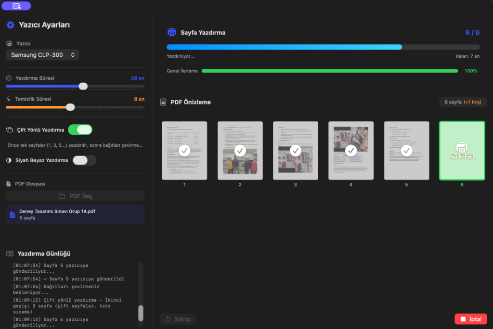
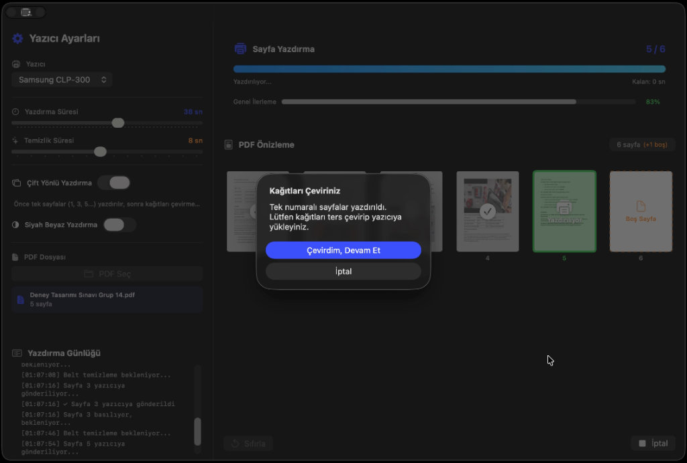
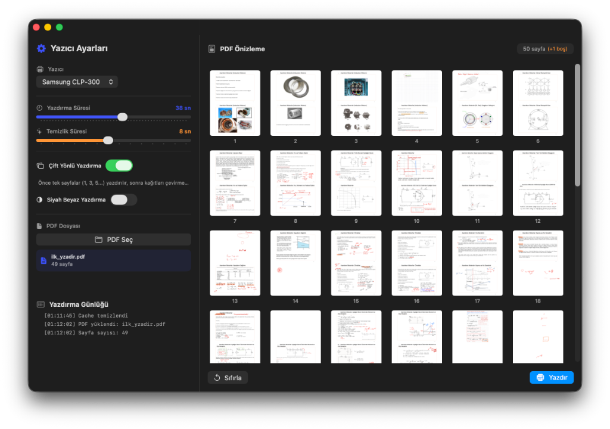

# 🖨️ PrinterManager for macOS

<p align="center">
  <a href="#-türkçe">🇹🇷 Türkçe</a> | <a href="#-english">🇬🇧 English</a>
</p>

---

# 🇹🇷 Türkçe

**Lazer yazıcılardaki belt (transfer kayışı) yıpranma sorununu çözen native macOS uygulaması.**

Çok sayfalı PDF'leri yazdırırken sayfalar arası bekleme süresi ayarlayarak, yazıcının transfer kayışının aşırı ısınmasını ve erken yıpranmasını önler.

> 🧪 **Test:** Samsung CLP-300 ile test edilmiştir, benzer sorun yaşayan tüm lazer yazıcılarda kullanılabilir.

## 📥 İndirme

<p align="center">
  <a href="https://github.com/emregms/printer-manager/releases/download/v1.0.0/PrinterManager-v1.0.0.dmg">
    
  </a>
</p>

### ⚠️ İlk Açılışta macOS Uyarısı

macOS imzasız uygulamaları engeller. Uygulamayı açmak için:

**Yöntem 1 - Terminal (Önerilen):**

```bash
xattr -cr /Applications/PrinterManager.app
```

**Yöntem 2 - Manuel:**

1. Uygulamaya **sağ tıklayın** (veya Control+tıklama)
2. **"Aç"** seçeneğini tıklayın
3. Açılan pencerede tekrar **"Aç"** butonuna tıklayın

## 📸 Ekran Görüntüleri

<p align="center">
  
  <br/>
  <em>Çoklu sayfa önizleme ve yazdırma ayarları</em>
</p>

<p align="center">
  
  <br/>
  <em>Sayfa sayfa yazdırma ve ilerleme durumu</em>
</p>

<p align="center">
  
  <br/>
  <em>Çift yönlü (duplex) yazdırma - kağıt çevirme uyarısı</em>
</p>

## ✨ Özellikler

| Özellik                      | Açıklama                                           |
| ---------------------------- | -------------------------------------------------- |
| ⏱️ **Ayarlanabilir Bekleme** | Yazdırma ve temizlik süreleri slider ile ayarlanır |
| 📄 **Sayfa Sayfa Yazdırma**  | Her sayfa ayrı ayrı yazıcıya gönderilir            |
| 🔄 **Çift Yönlü Yazdırma**   | Tek → Çevir → Çift sayfalar ters sırada            |
| 👁️ **PDF Önizleme**          | Thumbnail grid ile tüm sayfaları görüntüle         |
| ⏸️ **Durdur/Devam**          | Yazdırmayı duraklatıp devam ettirin                |
| ⏰ **Tahmini Süre**          | Kalan yazdırma süresini görün                      |
| 🖤 **Siyah Beyaz Modu**      | Daha hızlı ve ekonomik yazdırma                    |
| 🍎 **Native macOS**          | Swift + SwiftUI, Apple Silicon optimize            |

## � Gereksinimler

- macOS 13.0 (Ventura) veya üzeri
- Intel veya Apple Silicon (M1/M2/M3)

## 📖 Kullanım

1. **Yazıcı Seçin** → Dropdown'dan yazıcınızı seçin
2. **Süreleri Ayarlayın** → Yazdırma (30sn) + Temizlik (8sn)
3. **PDF Seçin** → Dosyanızı yükleyin
4. **Yazdır** → İlerlemeyi izleyin

---

# 🇬🇧 English

**Native macOS application that prevents laser printer transfer belt wear.**

Adds configurable delays between pages when printing multi-page PDFs, preventing the transfer belt from overheating and premature wear.

> 🧪 **Tested:** With Samsung CLP-300, compatible with all laser printers experiencing similar issues.

## 📥 Download

<p align="center">
  <a href="https://github.com/emregms/printer-manager/releases/download/v1.0.0/PrinterManager-v1.0.0.dmg">
    
  </a>
</p>

### ⚠️ macOS Security Warning on First Launch

macOS blocks unsigned applications. To open the app:

**Method 1 - Terminal (Recommended):**

```bash
xattr -cr /Applications/PrinterManager.app
```

**Method 2 - Manual:**

1. **Right-click** on the app (or Control+click)
2. Select **"Open"**
3. Click **"Open"** in the dialog

## 📸 Screenshots

<p align="center">
  
  <br/>
  <em>Multi-page preview and print settings</em>
</p>

<p align="center">
  
  <br/>
  <em>Page-by-page printing with progress tracking</em>
</p>

<p align="center">
  
  <br/>
  <em>Duplex (double-sided) printing - flip pages prompt</em>
</p>

## ✨ Features

| Feature                  | Description                              |
| ------------------------ | ---------------------------------------- |
| ⏱️ **Adjustable Delays** | Print and cleaning delays with sliders   |
| 📄 **Page-by-Page**      | Each page sent separately to printer     |
| 🔄 **Manual Duplex**     | Odd pages → Flip → Even pages reversed   |
| 👁️ **PDF Preview**       | Thumbnail grid for all pages             |
| ⏸️ **Pause/Resume**      | Pause and continue printing anytime      |
| ⏰ **Time Estimate**     | See remaining print time                 |
| 🖤 **Grayscale Mode**    | Faster and more economical               |
| 🍎 **Native macOS**      | Swift + SwiftUI, Apple Silicon optimized |

## 📋 Requirements

- macOS 13.0 (Ventura) or later
- Intel or Apple Silicon (M1/M2/M3)

## 📖 Usage

1. **Select Printer** → Choose from dropdown
2. **Set Delays** → Print (30s) + Cleaning (8s)
3. **Select PDF** → Load your file
4. **Print** → Monitor progress

---

## � Build from Source

```bash
git clone https://github.com/emregms/printer-manager.git
cd printer-manager
open PrinterManager.xcodeproj
# Press ⌘+R to run or ⌘+B to build
```

## 📄 License

MIT License - [Hüseyin Emre Gümüş](mailto:info@hegg.tr)

---

<p align="center">
  Made with ❤️ for macOS
</p>
